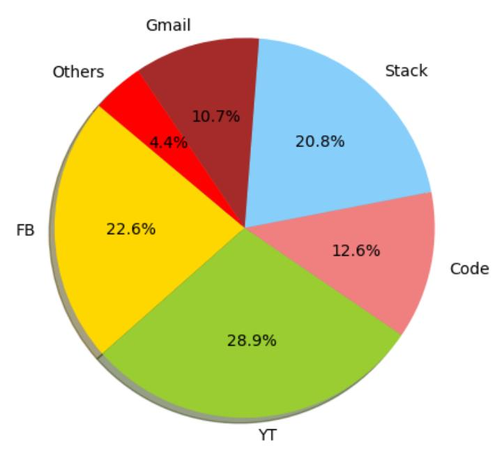

# Activity Monitoring Desktop Application

## Introduction
With the area of deep learning progressing rapidly, cool and helpful applications are being made day by day. In this blog post 
I am going to explain a similar application made by me, which monitors the computer activity automatically and after each 5 hours(pre defined) interval
tells how much time is spent doing what on the computer. So, basically it is a computer activity surveillance application
which is designed for employers that pay hefty salaries to client and expect fair work done in return.


Yeah that's what needs to be stopped

So these are the basic steps done in this application:

- Starts automatically when computer boots up.
- Takes screenshots after some random time of your computer screen
- After some time screenshot classifier executes and organizes screenshots in respective folders
- A pie graph is saved also which tells which applicaton/activity was used how frequently
- This process continues until computer shutdown or the application is closed

## Dataset
The most important factor of any deep learning application is data. The larger and bigger the data, the better the application
is made and is generalized well in production. The dataset of this application was made using a simple node js application that took screenshots and labeled them by renaming the folder name having images of some category. And the best part is that, by using that node js application one can make dataset of it's own choice so the application made is quite flexible and supports new categories/classes as well. The dataset used for creation of this application was of Ubuntu's screenshots of different categories.
But testing have shown that it works just fine on windows screenshots as well because the major portion of screenshot
is same and just sidebars are different.

## Working
So, the application runs when the computer starts. The screenshots are taken after some random interval of time by the node js application and are saved in a specific folder. After some time the node js application runs the model which is built using 
deep Convolutional Neural Network (CNN). CNNs are state of the art models for image classifiation so that's why they are used.
Those screenshots are then added to their respective folders and pie chart is also saved. 

## Results
So far this application classifies screenshot in 6 categories that are facebook, youtube, stack overflow, gmail, coding and others. The cross validation accuracy obtained so far is 94.5% on these 6 categories. The class others mean that
any screenshot that doesn't fall in these categories goes to others. During testing these were the results:-


## Evaluation
For visual evaluation purposes, when this application was being made CNN was tested extensively. Also by plotting screenshot
given to the nework and the predicted class. The only problem was that the screenshots of facebook and youtube, when watching
videos in full screen were indistinguishable. Becuase they look exactly the same, sometimes when control bar is displayed
only then can CNN classify them correctly otherwise it is just a random coin toss between both classes, because even a human
can't tell whether a video is of youtube or facebook if played in full screen mode. These are some of the results of the
predictions made by the CNN network, the misclassified ones are circled:-


And the pie graph is made by dividing occurence of one class by the total number of screenshots taken and then multiplied
by 100 to make it a percentage. So the ultimate goal is to just make employer aware of the fact that what his/her
employee is really doing and what's nicer than a colorful pie-chart depicting whole day's performance? Below is an example image shown of the pie chart made after some pre defined interval:-




## Dependencies
The following libraries are necessary for the deep learning model to work

```
Python3
Tflearn
Tensorflow
```

And the following libraries are necessary for the node js script to work i.e. taking screenshots, starting application
and calling the model after some intervals

```
electron-screenshot-service
fs
glob
```
